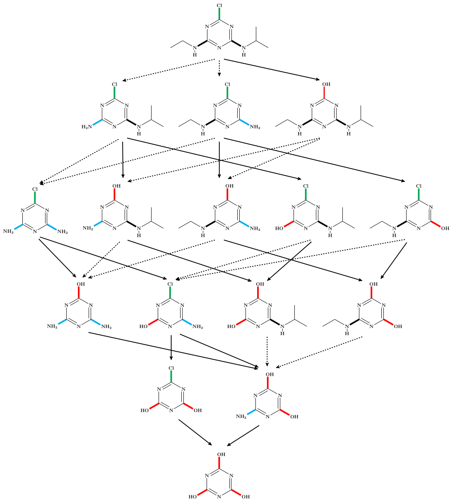
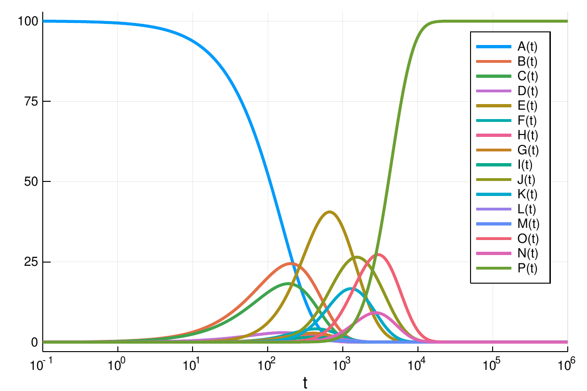
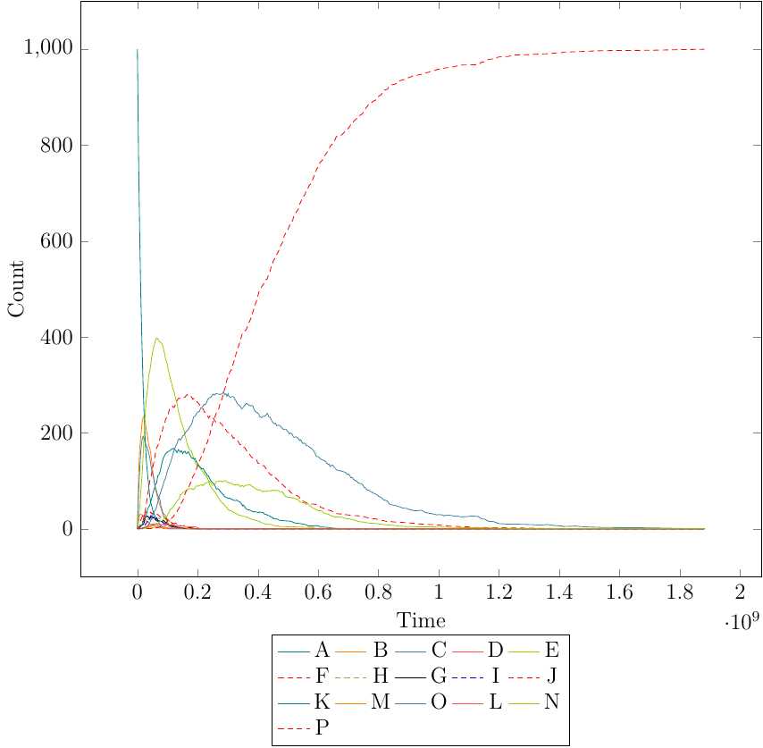
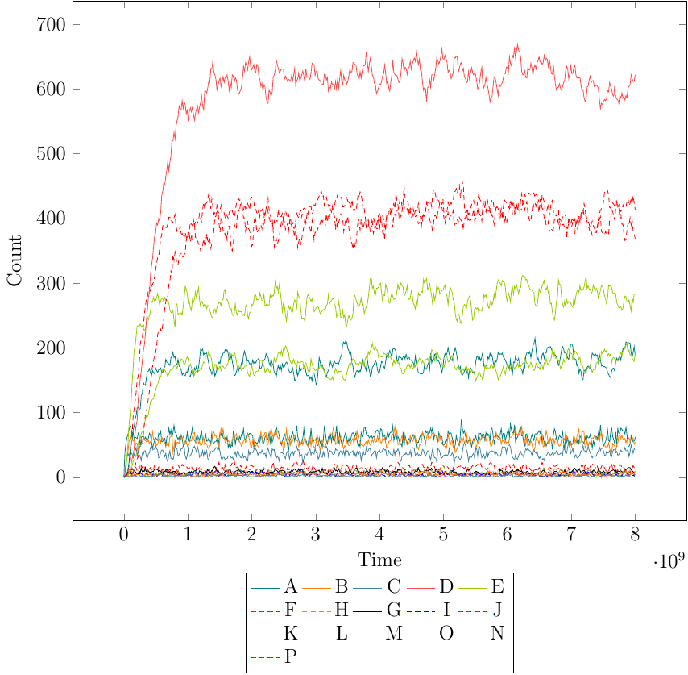

* Atrazine Degradation System

The degradation of ~s-triazine~ herbicides, such as ~atrazine~, under
anaerobic conditions in soil can be described by only two major reaction
types (Lit: Erickson LE, Lee KH and Sumner DD (1989), Degradation of
atrazine and related s-‐triazines, Crit Rev Env Control 19:1-14
doi: 10.1080/10643388909388356

For simulate the degradation dynamics using the following rate constants:

#+BEGIN_SRC
k_hydrolysis        = 5.00*10^-9
k_de-ethylation     = 3.32*10^-8
k_de-isopropylation = 2.65*10^-8
#+END_SRC

** Static Chemical Space Expansion

#+BEGIN_SRC bash
~$ mod -f flow.py
~$ # open the file summary/summary.pdf
#+END_SRC

The derivation graph of the ~atrazine~ degradation system is generated and
all possible 20 degradation pathways from ~atrazine~ (molecule A) to
~cyanuric acid~ (molecule P) are calculated via the hyperflow framework.

~summary/summary.pdf~ should look like ~atrazine-static.pdf~.

#+CAPTION: Degradation network compounds are named (A-P) from left to right and top to down. Bold arrows are hydrolysis and dashed arrows reductive de-alcylation reactions.

** Julia ODE Model of the Atrazine Degradation System

#+BEGIN_SRC bash
~$ julia
julia> include("atrazine.jl")
#+END_SRC

A window showing the time course should open after a while.
It should like similar to ~atrazine-ODEsol.png~.
Close the window and type ~exit()~ on the Julia prompt to exit Julia. 

#+CAPTION: Course of ODE simulation.

** Rule-Based Stochastic Simulation (closed system)

#+BEGIN_SRC bash
~$ mod -f stochsim_closed.py
~$ # open the file summary/summary.pdf
#+END_SRC

~summary/summary.pdf~ should look like ~atrazine-closed.pdf~.

#+CAPTION: Course of the SS in the closed stochatic simulation.

** Rule-Based Stochastic Simulation (open system)

#+BEGIN_SRC bash
~$ mod -f stochsim_open.py
~$ # open the file summary/summary.pdf
#+END_SRC

Setting the inflow and outflow rates of *molecule A* to the following
rates results in a novel non-equilibrium steady state (NESS), where
intermediate species coexist with the output *molecule P*.

#+BEGIN_SRC
k_inflow_A  = 4.00*10^-6
k_outflow_P = 1.00*10^-8
#+END_SRC

~summary/summary.pdf~ should look similar to ~atrazine-open-NESS.pdf~.

#+CAPTION: Course of the NESS in the open stochatic simulation.

** Rule-Based Stochastic Simulation (open system on deadlock)

#+BEGIN_SRC bash
~$ mod -f stochsim_open_OnDeadlock.py
~$ # open the file summary/summary.pdf
#+END_SRC

The system starts out as the closed system. When a deadlock is detected,
i.e., when no more reactions are possible because *molecule A* is depleted,
then the system is opened up, by setting the inflow and outflow rates as in
the open system.
The system then settles into the NESS.

~summary/summary.pdf~ should look similar to ~atrazine-open-OnDeadlock-NESS.pdf~.

** Further Technical Notes

Use ~pdftoppm -png FOO.pdf > FOO.png~ to convert a PDF to a PNG.
Use ~pandoc README.org -o README.pdf~ to convert the Org mode file into a PDF
#+BEGIN_SRC
=;) xtof
#+END_SRC
